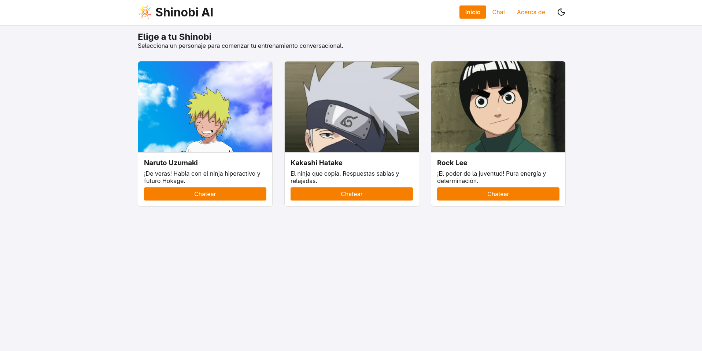
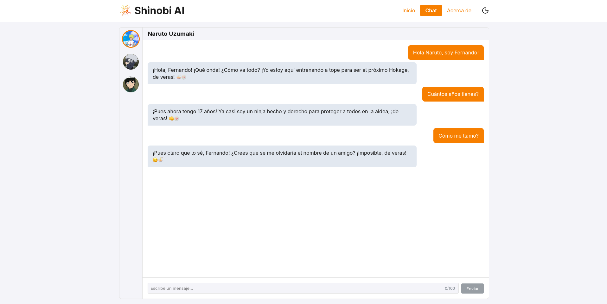
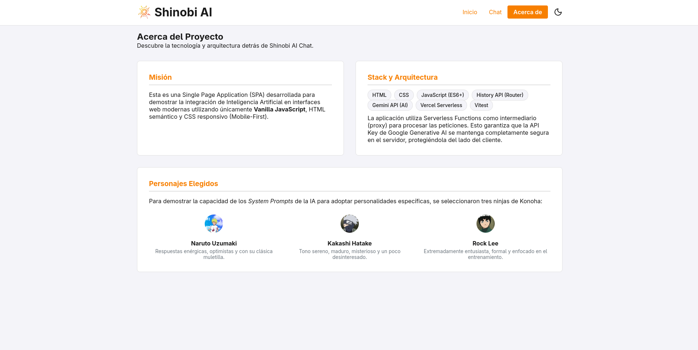
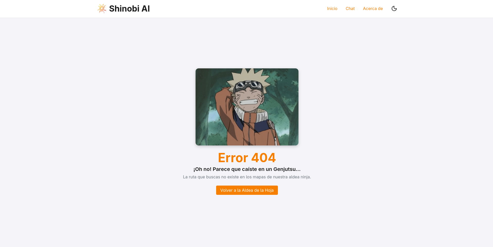

# Shinobi AI Chat

SPA (Single Page Application) responsive que integra la API de Google Gemini para simular conversaciones con personajes del anime Naruto. Construida con Vanilla JavaScript, HTML semantico y CSS responsivo (Mobile-First), sin ningun framework de frontend.

- URL del sitio desplegado: [https://proyecto-m3-fernando-perez-mojica.vercel.app/home](https://proyecto-m3-fernando-perez-mojica.vercel.app/home)

---

## Contenido

- [Personajes](#personajes)
- [Capturas de Pantalla](#capturas-de-pantalla)
- [Estructura del Proyecto](#estructura-del-proyecto)
- [Requisitos Previos](#requisitos-previos)
- [Configuración y Ejecución Local](#configuración-y-ejecución-local)
- [Suite de Pruebas](#suite-de-pruebas)
- [Despliegue en Vercel](#despliegue-en-vercel)
- [Registro de Uso de Inteligencia Artificial](#registro-de-uso-de-inteligencia-artificial)

---

## Personajes

La aplicacion permite chatear con tres ninjas de Konoha. Cada uno tiene un system prompt personalizado que define su personalidad, vocabulario y estilo de respuesta.

### Naruto Uzumaki

Ninja hiperactivo, alegre y algo distraido cuyo mayor sueño es convertirse en Hokage. Sus respuestas son energeticas, directas y optimistas. Utiliza la muletilla "De veras!" con frecuencia y demuestra lealtad absoluta hacia sus amigos. Configurado con temperatura alta (0.8) para maximizar la variedad y creatividad de sus respuestas.

### Kakashi Hatake

El Ninja Copiador, sensei del Equipo 7. Responde de forma serena, madura y ligeramente misteriosa. Suele llegar tarde y dar excusas poco convincentes por ello. Su tono es relajado y a veces desinteresado, pero siempre sabio. Configurado con temperatura baja (0.4) para respuestas mas predecibles y coherentes con el personaje.

### Rock Lee

Extremadamente entusiasta y cortez, Rock Lee esta obsesionado con el esfuerzo fisico y "el poder de la juventud". Al carecer de talento natural para el ninjutsu, lo compensa con trabajo duro y determinacion. Trata al usuario de "usted" y responde con mucha energia y motivacion. Configurado con temperatura media (0.7).

---

## Capturas de Pantalla

### Pantalla de inicio - Selección de personaje



### Vista de chat con Naruto




### Pantalla de vista `Acerca de`



### Pantalla de página no encontrada (404)



---

## Estructura del Proyecto

```text
ProyectoM3_FernandoPerezMojica/
├── index.html              # Shell HTML de la SPA
├── vercel.json             # Configuración de rewrites para la SPA y Serverless Functions
├── api/
│   └── chat.js             # Serverless Function: proxy seguro hacia la API de Gemini
├── public/
│   ├── assets/             # Imagenes de personajes y logo
│   └── css/
│       ├── variables.css   # Tokens de diseno (colores, tipografía, espaciado)
│       ├── global.css      # Reset y estilos base
│       ├── layout.css      # Estructura de layout general
│       └── components.css  # Estilos de todos los componentes de la UI
└── src/
    ├── app.js              # Punto de entrada: inicializa el router
    ├── components/
    │   └── Header.js       # Logo, cabecera con navegacion y toggle de tema
    ├── views/
    │   ├── Home.js         # Grid de seleccion de personaje
    │   ├── Chat.js         # Vista de chat y logica de interacción
    │   ├── About.js        # Informacion del proyecto y stack
    │   └── NotFound.js     # Pagina 404
    ├── router/
    │   └── index.js        # Router SPA basado en History API
    ├── store/
    │   └── chatStore.js    # Estado global: historial por personaje y estado de carga
    ├── engine/
    │   ├── aiClient.js     # Cliente HTTP para llamar a /api/chat
    │   ├── payload.js      # Constructor y validador del payload
    │   ├── normalizer.js   # Normaliza la respuesta de la API al formato interno
    │   ├── history.js      # Operaciones sobre el historial de mensajes
    │   └── mockApi.js      # Mock de la API para desarrollo sin clave real
    ├── config/
    │   └── prompts.js      # System prompts y configuración por personaje
    ├── utils/
    │   └── validators.js   # Validación del input del formulario de chat
    └── test/
        ├── aiClient.test.js
        ├── history.test.js
        ├── normalizer.test.js
        └── validators.test.js
```

---

## Requisitos Previos

Asegurate de tener instalado en tu sistema:

- [Node.js](https://nodejs.org/es/download) (versión 20.x o superior)
- npm (incluido con Node.js)
- [Vercel CLI](https://vercel.com/docs/cli) (necesario para emular el entorno serverless localmente)
- Una API Key valida de [Google AI Studio](https://aistudio.google.com/app/apikey)

Para instalar Vercel CLI globalmente:

```bash
npm install -g vercel
```

---

## Configuración y Ejecución Local

### 1. Clonar el repositorio e instalar dependencias

```bash
git clone https://github.com/fermop/ProyectoM3_FernandoPerezMojica.git
cd ProyectoM3_FernandoPerezMojica
npm install
```

### 2. Configurar las variables de entorno

Copia el archivo de ejemplo y renombralo a `.env`:

```bash
cp .env.example .env
```

Abre el archivo `.env` y reemplaza el valor con tu API Key de Google AI Studio:

```env
GEMINI_API_KEY=tu-api-key-aqui
```

> **Importante**: El archivo `.env` esta incluido en `.gitignore`. Nunca lo subas al repositorio. La API Key solo se utiliza en el servidor (Serverless Function); el cliente nunca la recibe.

### 3. Ejecutar con Vercel Dev

El proyecto requiere `vercel dev` en lugar de un servidor estatico convencional, ya que necesita emular el entorno de Serverless Functions para que el endpoint `/api/chat` funcione correctamente con las variables de entorno.

```bash
vercel dev
```

La aplicacion estara disponible en: `http://localhost:3000`

Si es la primera vez que usas Vercel CLI, te pedira que inicies sesión y vincules el proyecto. Puedes vincularlo a un proyecto existente o crear uno nuevo.

---

## Suite de Pruebas

La aplicación cuenta con pruebas unitarias para los modulos del engine, ejecutadas con **Vitest**.

Los modulos cubiertos son:

- `aiClient`: manejo de respuestas HTTP y errores del cliente
- `history`: operaciones de append y trim sobre el historial de mensajes
- `normalizer`: normalizacion del formato de respuesta de la API
- `validators`: validación del input del chat (longitud, estado de carga, vacíos)

### Ejecutar las pruebas

Para correr la suite completa una unica vez:

```bash
npm test
```

Para correr las pruebas en modo observacion (re-ejecuta al guardar cambios):

```bash
npm run test:watch
```

---

## Despliegue en Vercel

1. Ve a [vercel.com](https://vercel.com) e inicia sesión con tu cuenta de GitHub.
2. Haz clic en "Add New Project" e importa el repositorio `ProyectoM3_FernandoPerezMojica`.
3. Vercel detectará automaticamente la configuración del proyecto desde `vercel.json`.
4. En la seccion "Environment Variables", agrega la siguiente variable antes de desplegar:

   | Nombre | Valor |
   |---|---|
   | `GEMINI_API_KEY` | tu-api-key-de-google-ai-studio |

5. Haz clic en "Deploy". Vercel construirá y desplegará el proyecto automaticamente.

## Registro de Uso de Inteligencia Artificial

Este proyecto fue desarrollado integrando herramientas de IA generativa (Google Gemini) bajo una dinámica de *pair programming*. El uso de la inteligencia artificial no se limitó a la generación de código, sino que se enfocó en el análisis arquitectónico, la resolución de casos borde y la implementación de buenas prácticas de desarrollo modular.

Las principales áreas donde la IA actuó como herramienta de asistencia fueron:

* **Arquitectura y Refactorización Modular:** Asistencia en la transición hacia una arquitectura basada en un `engine` interno (`history.js`, `payload.js`, `normalizer.js`, `aiClient.js`). Esto permitió desacoplar la lógica de negocio y comunicación de la API de la manipulación directa del DOM, garantizando un código más limpio y escalable.
* **Implementación de Pruebas Unitarias (TDD):** Apoyo en la configuración y redacción de la suite de pruebas utilizando Vitest. Se crearon tests para las funciones puras de validación y para el manejo del historial, incluyendo el *mocking* complejo de la API `fetch` global para aislar las pruebas del cliente sin consumir cuota de red.
* **Diagnóstico y Prevención de Bugs (Sanitización):** Identificación de problemas de renderizado en el navegador causados por el formato de *roleplay* de la IA (uso de caracteres `<` y `>`). Se resolvió mediante la implementación de utilidades de sanitización (`escapeHtml`) para proteger la interfaz.
* **Seguridad y Control de Cuotas:** Diseño de la lógica de validadores puros para el input del usuario (`validators.js`). Se implementaron límites estrictos de caracteres (100 máximo) y bloqueos dinámicos en la UI para prevenir peticiones vacías, protegiendo el consumo de tokens de la Serverless Function.
* **Configuración de Despliegue (Serverless):** Orientación en la resolución de problemas de enrutamiento nativos de las *Single Page Applications* (SPA) mediante la configuración exacta de las reglas en `vercel.json` para gestionar correctamente los errores 404.

### Flujo de Trabajo y Prompt Arquitectónico Inicial

Para garantizar que el desarrollo de esta SPA se mantuviera alineado con las mejores prácticas de ingeniería de software, se estableció desde el inicio una dinámica estructurada de **Pair Programming** con la Inteligencia Artificial. 

En lugar de solicitar la generación de la aplicación en un solo paso, se diseñó un *Master Prompt* (Prompt de contexto) que definió las reglas, la arquitectura, las restricciones técnicas y la metodología iterativa.

**Metodología de trabajo colaborativo:**
1. **Desarrollo Iterativo y Progresivo:** La construcción se dividió en fases lógicas y secuenciales: primero el *Boilerplate* y *Routing*, luego la Interfaz UI aislada usando datos *mock*, posteriormente la integración con la API Serverless y, finalmente, las pruebas unitarias.
2. **Validación Humana Continua:** Ningún fragmento de código se integró ciegamente. Cada propuesta de la IA fue revisada, cuestionada y validada por el desarrollador para asegurar que cumpliera con los estándares de *Clean Code*.
3. **Control de Versiones Disciplinado:** Se delegó en la IA la sugerencia de mensajes de commit atómicos siguiendo las convenciones de *Conventional Commits* (`feat`, `fix`, `refactor`, `test`), manteniendo un historial en inglés, semántico y fácil de auditar.
4. **Restricciones de Código Estrictas:** Se establecieron límites claros: prohibición de dependencias innecesarias (sin `axios` ni bibliotecas de UI), enfoque en seguridad (ocultamiento de API Key mediante Serverless) y preferencias de estilo inmutables (lógica en inglés, contenido en español, y JavaScript sin puntos y comas).

A continuación, se documenta el prompt exacto utilizado para inicializar este flujo de trabajo:

> **Prompt Inicial:**
> 
> **ROL**
> Actúa como Desarrollador Web Full Stack Senior.
> 
> **CONTEXTO**
> Me ayudarás a crear un SPA responsive para mobile, tablet y desktop utilizando HTML, CSS y JavaScript. La app consiste en una página con vistas en "/home", "/chat" y "/about" para un chat que hace fetch a la API de Gemini utilizando el SDK y Vercel Serverless Functions para evitar exponer la API Key del lado del cliente. El historial de conversación se mantiene solo durante la sesión (mientras no se recargue la aplicación).
> 
> **STACK**
> 1. **HTML:** Me ayudarás a construir la app con HTML semántico con buenas prácticas de SEO y accesibilidad para lectores de pantalla. Todas las vistas tendrán un componente header/nav reutilizable para la navegación de las vistas/rutas.
> 
> 2. **CSS:** La app es responsive utilizando flexbox/grid para Mobile, Tablet y Desktop utilizando diseño mobile-first y unidades relativas como rem y porcentajes. El diseño será modo oscuro/claro con toggle y el diseño por vistas será:
> - `/home`: Página de bienvenida con 3 cards de descripción de los siguientes personajes de Naruto: Naruto, Kakashi y Rock Lee. Cada card tiene su respectivo botón para empezar a chatear que redirige a "/chat" y dependiendo el personaje elegido es el system/context prompt (cómo habla el personaje, qué sabe, qué limitaciones tiene, y que debe dar respuestas cortas apropiadas para chat).
> - `/chat`: Interfaz de chat donde se desarrolla la conversación. Esta interfaz es similar a la de WhatsApp pero con colores y tipografías que dan la esencia del Anime Naruto. Tendrá un Sidebar en el lado izquierdo con imágenes redondas de los tres personajes como acceso directo a cada chat, una encima de la otra (verticalmente). El resto del contenido será para el chat, con estilos para diferenciar mensajes del usuario y mensajes emitidos por las respuestas de la IA.
> - `/about`: Información sobre el proyecto y los personajes elegidos. Similar a '/home'.
> 
> 3. **JS:**
> - Fetch a la API.
> - Transformado de datos para pasar al renderizado los datos normalizados.
> - Render de vistas y manejaremos correctamente una vista para rutas inexistentes con link devuelva a '/home'.
> - Utilizaremos history api para cambiar la URL sin recargar la página. Asegúrate de manejar el evento popstate para que los botones back y forward del navegador funcionen correctamente.
> 
> 4. **Vitest:**
> Pruebas unitarias de funciones de transformación de datos y parseo de respuestas de la API y pruebas usando datos mock para funciones fetch.
> 
> **RESTRICCIONES**
> No utilizaremos dependencias como dotenv o axios. Utilizaremos la forma nativa para leer variables de entorno (ej. process.env.GEMINI_API_KEY) y fetch para peticiones HTTP. Solo instalaremos @google/generative-ai y vitest como dependencia de desarrollo.
> 
> **ESTRUCTURA DE PROYECTO**
> - Priorizaremos la modularización para una buena organización del proyecto y utilizaremos los alias import de node para rutas personalizables utilizando '#'.
> - El código debe estar en inglés para internacionalizarlo y que cualquier persona pueda leerlo, siguiendo buenas practicas de clean code, con los comentarios de código si es que son necesarios.
> - El contenido de la aplicación debe estar en español (placeholders, títulos, descripciones, etc.).
> - El historial de commits igual será en inglés, siguiendo convenciones de commits (feat, fix, style, doc, chore, etc.).
> - El código JavaScript no llevará punto y coma (;) al final de las líneas de código, esto por preferencia personal.
> 
> **COMPORTAMIENTO**
> - La idea es construir el proyecto progresivamente.
> - Me darás el código necesario por archivo, así sea todo el código o solamente una sección a cambiar.
> - Proporcionarás mensajes de commits a tu criterio sobre cuándo hacerlos, esto para que podamos tener un historial limpio y bien estructurado.
> - Cuando me des código a implementar lo revisaré para validar y una vez validado seguimos con la construcción del proyecto. En dado caso de que yo no entienda el por qué implementaste cosas de cierta manera o código que no entiendo te preguntaré por qué tomaste ciertas decisiones y una vez que haya entendido avanzamos con lo demás.
> 
> **PLAN**
> El primer paso que haremos es definir la estructura/boilerplate del proyecto, incluyendo dependencias, configuraciones iniciales y archivos vacíos o con contenido necesario para el primer commit, progresivamente avanzaremos con la construcción del proyecto. Cuando lleguemos a la parte del Chat, antes de conectar la inteligencia artificial, implementaremos el chat usando un array de mensajes en memoria para probar la interfaz, verificar el scroll automático y validar la lógica de renderizado sin depender aún de la AI.

### Aceleración del Desarrollo y Productividad

Además de establecer la arquitectura base, la Inteligencia Artificial se utilizó activamente como una herramienta de productividad para acelerar la escritura de código y modificar implementaciones. Por ejemplo, en lugar de escribir manualmente toda la lógica del DOM y las animaciones CSS desde cero, se le proporcionó a la IA el contexto completo de la versión de ese momento del proyecto y los recursos necesarios (como los íconos SVG).

Esto permitió generar la interactividad y los estilos responsivos de manera sumamente rápida, permitiendo al desarrollador delegar el trabajo mecánico y enfocarse exclusivamente en la integración y la experiencia de usuario.

Como se mencionaba anteriormente, un ejemplo claro de cómo se delegó la creación de componentes interactivos (en este caso, la lógica y animación del menú hamburguesa) es el siguiente prompt:

> **Prompt de Productividad (Implementación de UI):**
> 
> Antes de avanzar con la integración de los System Prompts, haremos un par de integraciones en la UI de la app. Te aviso cuando podamos avanzar con los System Prompts.
> 
> Acabo de agregar 2 divs al Header.js para centralizar horizontalmente el contenido del header y agrupar el nav con el botón toggler del tema, esto para agregar un botón hamburgesa en dispositivos móviles (menor a un width de 540px).
> 
> Ayúdame a agregar la lógica para el botón hamburguesa, mostrando y ocultando el menú como si fuese un sidebar que aparece de derecha a izquierda con una animación sutil.
> 
> ícono menu: `<svg xmlns="http://www.w3.org/2000/svg" width="24" height="24" viewBox="0 0 24 24" fill="none" stroke="currentColor" stroke-width="2" stroke-linecap="round" stroke-linejoin="round" class="lucide lucide-menu-icon lucide-menu"><path d="M4 5h16"/><path d="M4 12h16"/><path d="M4 19h16"/></svg>`
> 
> ícono 'x' para cerrar el menu: `<svg xmlns="http://www.w3.org/2000/svg" width="24" height="24" viewBox="0 0 24 24" fill="none" stroke="currentColor" stroke-width="2" stroke-linecap="round" stroke-linejoin="round" class="lucide lucide-x-icon lucide-x"><path d="M18 6 6 18"/><path d="m6 6 12 12"/></svg>`